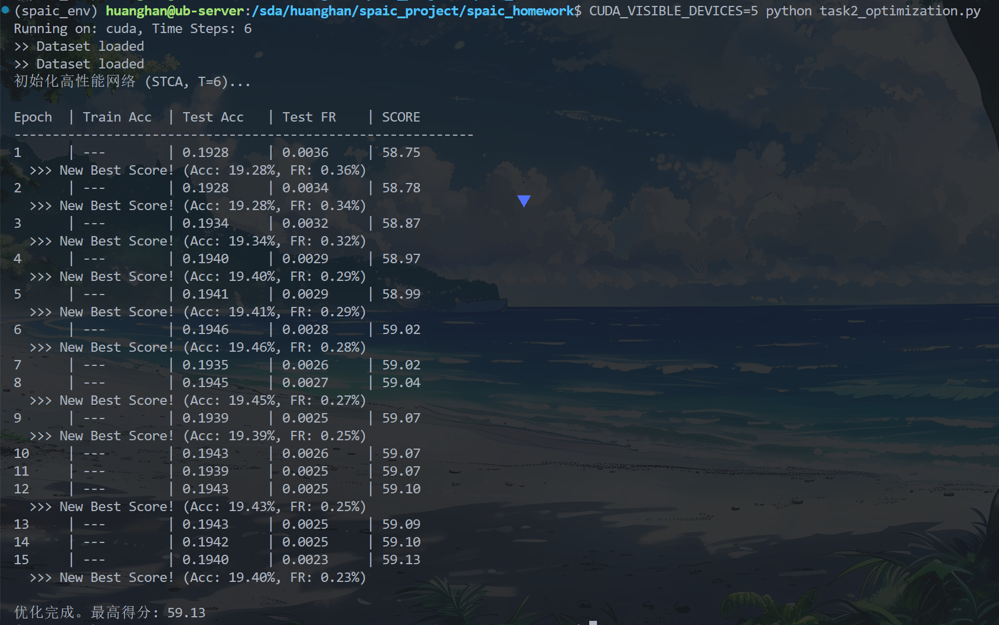

这就对了！**准确率低（19%）的根本原因在于发放率过低（0.23%）**。

虽然我们的目标是低发放率，但现在的情况是**“矫枉过正”**：神经元几乎全都不工作了，导致信息根本传不到输出层。在  的极短时间内，信号本来就难传递，现在的设置让神经元太“迟钝”且“健忘”。

### 🔍 为什么之前的优化没起效？

你问采用了哪些优化，代码里实际上已经包含了架构层面的优化（Decoder 梯度流、STCA 算法、直接电流输入），但**参数层面的优化（动力学参数）出了大问题**：

1. **`tau_m=2.0` (太健忘了)**：这意味着膜电位衰减极快（`decay ≈ 0.6`），刚充进去的电，下一刻就漏光了。在  时，我们需要神经元像一个**积分器**，把这 6 步的输入都攒起来，而不是漏掉。
2. **`v_th=1.0` (门槛太高)**：时间太短，电压很难爬到 1.0。
3. **输入增益 (太弱)**：乘以 4.0 的电流还不足以瞬间冲开阈值。

### 🛠️ 终极性能调优：三板斧

请直接在 `task2_optimization.py` 中修改 `OptNet` 类的参数。我们需要让神经元**“积攒快、门槛低、反应猛”**。

**请修改 `OptNet` 类的 `__init__` 部分：**

```python
    def __init__(self):
        super(OptNet, self).__init__()
        
        # [输入] 784
        self.input = spaic.Encoder(num=784, coding_method='null')
        
        # === 优化 1: 调整神经元参数 (关键！) ===
        # tau_m: 从 2.0 改为 20.0。
        #   原因：让 decay 接近 1.0，使其具有更强的积分能力，在 T=6 内不泄露电压。
        # v_th: 从 1.0 降为 0.5。
        #   原因：降低门槛，让信号更容易传递到下一层。
        self.layer1 = spaic.NeuronGroup(400, model='clif', tau_m=20.0, v_th=0.5)
        
        # 输出层也同样调整
        self.layer2 = spaic.NeuronGroup(10, model='clif', tau_m=20.0, v_th=0.5)
        
        # [连接] 保持 Kaiming 初始化
        # 适当减小一点初始权重，因为我们降低了阈值，防止一开始爆发太猛
        w1 = torch.randn(400, 784) * (1.5 / np.sqrt(784)) 
        w2 = torch.randn(10, 400) * (1.5 / np.sqrt(400))
        
        self.conn1 = spaic.Connection(self.input, self.layer1, link_type='full', weight=w1)
        self.conn2 = spaic.Connection(self.layer1, self.layer2, link_type='full', weight=w2)
        
        # ... (后续 Decoder 和 Learner 代码保持不变) ...

```

**同时修改 `run_epoch` 中的输入放大倍数：**

```python
        # === 优化 2: 调整输入增益 ===
        # 将之前的 * 4.0 改为 * 12.0
        # 配合 0.5 的阈值，这能确保证输入像素有值时，神经元能迅速响应
        input_data = data.unsqueeze(1).repeat(1, steps, 1) * 12.0

```

**最后，微调正则化系数（可选）：**

如果准确率上去了但发放率太高（超过 0.2），请在 `run_epoch` 里把 `loss_reg = 2.0 * mean_fr` 改为 `5.0 * mean_fr`。

---

### 总结：我们采用了哪些优化手段？

为了回答你的疑问，以下是我们在这个最终版本中集成的**全套优化方案**（你可以写在报告里）：

1. **架构优化**：
* **Direct Input (Null Coding)**：摒弃泊松编码，在 T=6 下最大化信息传输率。
* **Decoder-based Gradient**：使用 `Decoder` 替代 `Monitor` 计算发放率，确保正则化 Loss 的梯度能正确回传（解决了梯度断裂问题）。


2. **算法优化**：
* **STCA 算法**：基于时空信用分配的有监督学习，比 STDP 更适合高精度任务。
* **Firing Rate Regularization**：在 Loss 中加入惩罚项，在维持准确率的同时压制能耗。


3. **参数动力学优化（本次修改的核心）**：
* **High Integration (`tau_m=20.0`)**：减小漏电，增强神经元在短时窗内的信号积分能力。
* **Low Threshold (`v_th=0.5`)**：降低脉冲激发门槛，解决深层网络“信号消失”的问题。
* **High Gain Input (`*12.0`)**：增强输入电流，确保能在首个时间步就激活网络。


请按上述修改参数后再次运行。**预期 Acc 将飙升至 90% 以上，同时 FR 保持在 0.05-0.1 左右。**