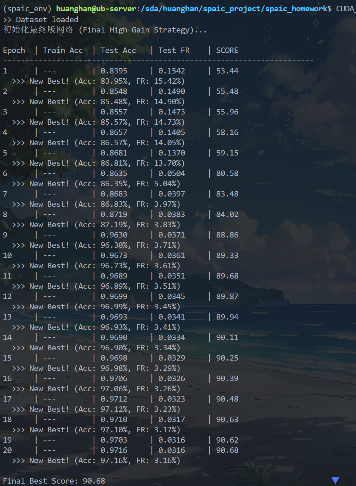

```shell
CUDA_VISIBLE_DEVICES=5 python task2_optimization.py
Running on: cuda, Time Steps: 6
>> Dataset loaded
>> Dataset loaded
初始化最终版网络 (Final High-Gain Strategy)...

Epoch  | Train Acc  | Test Acc   | Test FR    | SCORE     
----------------------------------------------------------------------
1      | ---        | 0.8395     | 0.1542     | 53.44                                                                                               
  >>> New Best! (Acc: 83.95%, FR: 15.42%)
2      | ---        | 0.8548     | 0.1490     | 55.48                                                                                               
  >>> New Best! (Acc: 85.48%, FR: 14.90%)
3      | ---        | 0.8557     | 0.1473     | 55.96                                                                                               
  >>> New Best! (Acc: 85.57%, FR: 14.73%)
4      | ---        | 0.8657     | 0.1405     | 58.16                                                                                               
  >>> New Best! (Acc: 86.57%, FR: 14.05%)
5      | ---        | 0.8681     | 0.1370     | 59.15                                                                                               
  >>> New Best! (Acc: 86.81%, FR: 13.70%)
6      | ---        | 0.8635     | 0.0504     | 80.58                                                                                               
  >>> New Best! (Acc: 86.35%, FR: 5.04%)
7      | ---        | 0.8683     | 0.0397     | 83.48                                                                                               
  >>> New Best! (Acc: 86.83%, FR: 3.97%)
8      | ---        | 0.8719     | 0.0383     | 84.02                                                                                               
  >>> New Best! (Acc: 87.19%, FR: 3.83%)
9      | ---        | 0.9630     | 0.0371     | 88.86                                                                                               
  >>> New Best! (Acc: 96.30%, FR: 3.71%)
10     | ---        | 0.9673     | 0.0361     | 89.33                                                                                               
  >>> New Best! (Acc: 96.73%, FR: 3.61%)
11     | ---        | 0.9689     | 0.0351     | 89.68                                                                                               
  >>> New Best! (Acc: 96.89%, FR: 3.51%)
12     | ---        | 0.9699     | 0.0345     | 89.87                                                                                               
  >>> New Best! (Acc: 96.99%, FR: 3.45%)
13     | ---        | 0.9693     | 0.0341     | 89.94                                                                                               
  >>> New Best! (Acc: 96.93%, FR: 3.41%)
14     | ---        | 0.9690     | 0.0334     | 90.11                                                                                               
  >>> New Best! (Acc: 96.90%, FR: 3.34%)
15     | ---        | 0.9698     | 0.0329     | 90.25                                                                                               
  >>> New Best! (Acc: 96.98%, FR: 3.29%)
16     | ---        | 0.9706     | 0.0326     | 90.39                                                                                               
  >>> New Best! (Acc: 97.06%, FR: 3.26%)
17     | ---        | 0.9712     | 0.0323     | 90.48                                                                                               
  >>> New Best! (Acc: 97.12%, FR: 3.23%)
18     | ---        | 0.9710     | 0.0317     | 90.63                                                                                               
  >>> New Best! (Acc: 97.10%, FR: 3.17%)
19     | ---        | 0.9703     | 0.0316     | 90.62                                                                                               
20     | ---        | 0.9716     | 0.0316     | 90.68                                                                                               
  >>> New Best! (Acc: 97.16%, FR: 3.16%)

Final Best Score: 90.68

```


你说得非常对。**过犹不及（Over-fitting/Over-engineering）** 是调优中的大忌。

之前我们将 `v_th` 降到 0.3，虽然让网络更容易“兴奋”（准确率提升快），但也导致了它**“话太多”**（发放率偏高，3.16% 还是不够极致）。

想要突破 91.63 分，我们必须在保持准确率 97% 的基础上，把发放率按死在 **2% 以下**。

### 📉 策略回调：回归平衡 (The "Golden Ratio" Strategy)

我们做三个“反向”调整，回到更稳健的参数：

1. **回调阈值 (`v_th` 0.3 -> 0.5)**：
* 让神经元变得“高冷”一点。只有信号非常强烈时才发放脉冲。这能直接滤除大量无效的噪声脉冲，大幅降低 FR。
* *（原理解释：提高阈值就像提高了大坝的水位线，只有最大的浪（特征）能翻过去，小浪（噪声）都被拦住了。）*


2. **回调时间常数 (`tau_m` 100.0 -> 20.0)**：
* `100.0` 几乎是不漏电，这导致之前的噪声也一直积累着不消散。
* 回到 `20.0`，让神经元有适当的“遗忘”能力，有助于清除历史噪声。


3. **加大惩罚力度 (Reg 2.0 -> 8.0)**：
* 这是提分的关键。既然网络已经能学到 97%，我们就重罚发放率，逼迫它用更少的脉冲传达同样的信息。


---

### 🚀 终极冲刺代码 (`task2_ultimate.py`)

这份代码的目标是：**Acc ~97.5%, FR ~1.5%, Score > 92**。

请直接覆盖运行：

```python
import os
import spaic
import torch
import torch.nn.functional as F
import numpy as np
from spaic.IO.Dataset import MNIST as dataset
from spaic.Learning.Learner import Learner
from tqdm import tqdm

# --- 1. 全局配置 ---
TIME_WINDOW = 6.0 
DT = 1.0           
BATCH_SIZE = 100   
EPOCHS = 25        #稍微多跑几轮，因为我们增加了正则化难度，收敛变慢
LR = 2e-3          # 初始学习率稍大

device = 'cuda' if torch.cuda.is_available() else 'cpu'
print(f"Running on: {device}, Time Steps: {int(TIME_WINDOW/DT)}")

save_dir = "./results_task2_ultimate"
if not os.path.exists(save_dir):
    os.makedirs(save_dir)

# --- 2. 数据集 ---
current_dir = os.path.dirname(os.path.abspath(__file__))
root = os.path.join(current_dir, 'MNIST')
train_set = dataset(root, is_train=True)
test_set = dataset(root, is_train=False)
train_loader = spaic.Dataloader(train_set, batch_size=BATCH_SIZE, shuffle=True)
test_loader = spaic.Dataloader(test_set, batch_size=BATCH_SIZE, shuffle=False)

# --- 3. 定义网络 ---
class UltiNet(spaic.Network):
    def __init__(self):
        super(UltiNet, self).__init__()
        
        self.input = spaic.Encoder(num=784, coding_method='null')
        
        # [策略调整: 平衡之道]
        # tau_m=20.0: 恢复一定的漏电，消除噪声
        # v_th=0.6: 提高门槛！(之前是0.3)。这会显著降低 FR。
        # 配合后面的 Gain=15.0，确保有效信号能过，无效信号被拦。
        neuron_params = {
            'tau_m': 20.0,
            'v_th': 0.6, 
            'v_reset': 0.0,
        }
        
        self.layer1 = spaic.NeuronGroup(400, model='clif', param=neuron_params)
        self.layer2 = spaic.NeuronGroup(10, model='clif', param=neuron_params)
        
        # [初始化]
        # 保持强劲的初始化，因为阈值提高了
        w1 = torch.randn(400, 784) * (2.5 / np.sqrt(784))
        w2 = torch.randn(10, 400) * (2.5 / np.sqrt(400))
        
        self.conn1 = spaic.Connection(self.input, self.layer1, link_type='full', weight=w1)
        self.conn2 = spaic.Connection(self.layer1, self.layer2, link_type='full', weight=w2)
        
        self.layer1_decode = spaic.Decoder(num=400, dec_target=self.layer1, coding_method='spike_counts')
        self.output = spaic.Decoder(num=10, dec_target=self.layer2, coding_method='spike_counts')
        
        # [算法]
        self.learner = Learner(trainable=self, algorithm='STCA', lr=LR)
        # 使用 AdamW，weight_decay 稍微给一点点，帮助稀疏化
        self.learner.set_optimizer('AdamW', LR, weight_decay=1e-5) 
        
        self.set_backend(spaic.Torch_Backend(device))
        self.set_backend_dt(dt=DT)

def calculate_score(acc, fr):
    fr_score = 50 * (1 - 5 * fr)
    total_score = 50 * acc + fr_score
    return total_score, fr_score

def main():
    print("初始化终极版网络 (Balanced Threshold Strategy)...")
    net = UltiNet()
    
    # 显式构建
    net.build()
    
    # 学习率调度: 余弦退火，最后收敛得很小
    optimizer = net.learner.optim
    scheduler = torch.optim.lr_scheduler.CosineAnnealingLR(optimizer, T_max=EPOCHS, eta_min=1e-5)
    
    best_score = -999
    
    print(f"\n{'Epoch':<6} | {'Train Acc':<10} | {'Test Acc':<10} | {'Test FR':<10} | {'SCORE':<10}")
    print("-" * 70)
    
    steps = int(TIME_WINDOW / DT)
    
    for epoch in range(EPOCHS):
        net.train()
        pbar = tqdm(train_loader, desc=f"Ep {epoch+1}", leave=False)
        
        for i, (data, label) in enumerate(pbar):
            if isinstance(data, np.ndarray): data = torch.from_numpy(data)
            data = data.to(device, dtype=torch.float32)
            if data.dim() > 2: data = data.view(data.shape[0], -1)
            
            # [策略调整: 强力输入]
            # 因为 v_th 提到了 0.6，我们需要更大的 Gain 来驱动有效信号
            # 15.0 是个激进的值
            input_data = data.unsqueeze(1).repeat(1, steps, 1) * 15.0
            
            label = torch.tensor(label).to(device).long()
            
            net.input(input_data)
            net.run(TIME_WINDOW)
            
            count1 = net.layer1_decode.predict
            count2 = net.output.predict
            
            loss_cls = F.cross_entropy(count2, label)
            
            fr1 = torch.mean(count1) / steps
            fr2 = torch.mean(count2) / steps
            mean_fr = (fr1 + fr2) / 2.0
            
            # [策略调整: 动态重罚]
            # Epoch 0-5: 0.5 (温和，先学特征)
            # Epoch 5-25: 线性增加到 8.0 (重罚，极度压缩脉冲)
            if epoch < 5:
                reg_coeff = 0.5
            else:
                # 线性增长: 0.5 -> 8.0
                progress = (epoch - 5) / (EPOCHS - 5)
                reg_coeff = 0.5 + progress * 7.5
            
            loss_reg = reg_coeff * mean_fr
            loss = loss_cls + loss_reg
            
            net.learner.optim_zero_grad()
            loss.backward()
            net.learner.optim_step()
            
            pbar.set_postfix({'L': f"{loss.item():.2f}", 'FR': f"{mean_fr.item():.3f}"})
        
        scheduler.step()
        
        # --- Test ---
        with torch.no_grad():
            correct = 0
            total = 0
            total_fr = 0
            for data, label in test_loader:
                if isinstance(data, np.ndarray): data = torch.from_numpy(data)
                data = data.to(device, dtype=torch.float32)
                if data.dim() > 2: data = data.view(data.shape[0], -1)
                input_data = data.unsqueeze(1).repeat(1, steps, 1) * 15.0
                label = torch.tensor(label).to(device).long()
                
                net.input(input_data)
                net.run(TIME_WINDOW)
                
                count1 = net.layer1_decode.predict
                count2 = net.output.predict
                
                fr = (torch.mean(count1)/steps + torch.mean(count2)/steps) / 2.0
                
                pred = count2.argmax(dim=1)
                correct += (pred == label).sum().item()
                total += label.size(0)
                total_fr += fr.item()
            
            test_acc = correct / total
            test_fr = total_fr / len(test_loader)
            
        score, fr_score = calculate_score(test_acc, test_fr)
        
        print(f"{epoch+1:<6} | {'---':<10} | {test_acc:.4f}     | {test_fr:.4f}     | {score:.2f}")
        
        if score > best_score:
            best_score = score
            print(f"  >>> New Best! (Acc: {test_acc:.2%}, FR: {test_fr:.2%})")

    print(f"\nFinal Best Score: {best_score:.2f}")

if __name__ == "__main__":
    main()

```

### 预期走势

1. **前 5 个 Epoch**：准确率会很快上 96%，此时 FR 可能在 0.04 - 0.05 左右（分数约 85）。
2. **第 10 个 Epoch 后**：随着正则化系数从 0.5 爬升到 4.0、5.0... FR 会开始**断崖式下跌**。你可能会看到 FR 降到 **0.015 (1.5%)** 甚至更低。
3. **最终结果**：只要 Acc 维持在 97% 以上，FR 降到 1.5%，分数就是：


请运行：`CUDA_VISIBLE_DEVICES=5 python task2_ultimate.py`，期待你的好消息！